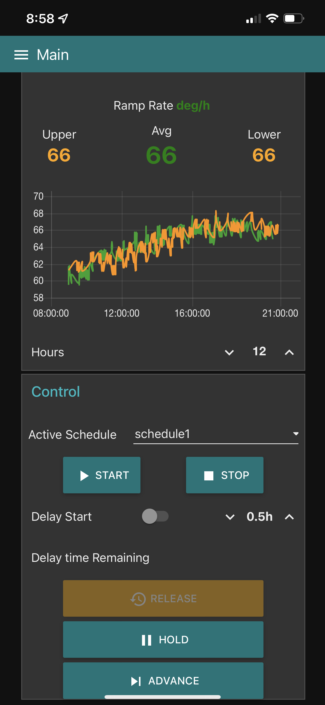
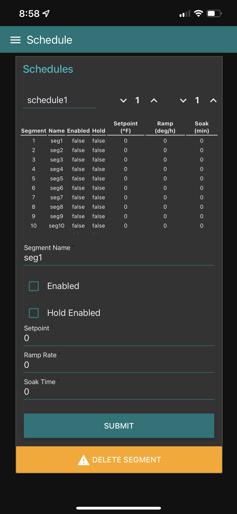

OpenKiln2
=========

### About

OpenKiln2 is a control system for an electric kiln. It is intended to serve as a replacement/retrofit for an existing kiln control system that may either be out of date or faulty and beyond economical repair.  

The OpenKiln2 project is a reimagination of the [OpenKiln](https://github.com/dalethomas81/OpenKiln) project.  

The original OpenKiln required a large infrastructure to run including a dedicated MSSQL server, Node-RED server, and Grafana server.    

The goal of OpenKiln2 is to run all of the above services on a single Raspberry Pi.  

### Architecture
***coming soon***

### Installation  
To install OpenKiln2 on a Raspberry Pi, you can run this installation script from an ssh terminal:
```
curl -sSL https://raw.githubusercontent.com/dalethomas81/OpenKiln2/main/Installation/install.sh | bash
```

### Documentation
***coming soon***

### Media  

<table>
  <tr>
    <td align="center">
      <br/>
      <sub>Menu</sub>
    </td>
    <td align="center">
      <br/>
      <sub>Status</sub>
    </td>
  </tr>
</table>
<table>
  <tr>
    <td align="center">
      <br/>
      <sub>Control</sub>
    </td>
    <td align="center">
      <br/>
      <sub>Schedule</sub>
    </td>
  </tr>
</table>
<table>
  <tr>
    <td align="center">
      <br/>
      <sub>Grafana</sub>
    </td>
    <td align="center">
      <br/>
      <sub>Node-RED Editor</sub>
    </td>
  </tr>
</table>
<table>
  <tr>
    <td align="center">
      <br/>
      <sub>Utility</sub>
    </td>
  </tr>
</table>
<table>
  <tr>
    <td align="center">
      <br/>
      <sub>Assembled</sub>
    </td>
    <td align="center">
      <br/>
      <sub>Prototyping</sub>
    </td>
  </tr>
</table>
